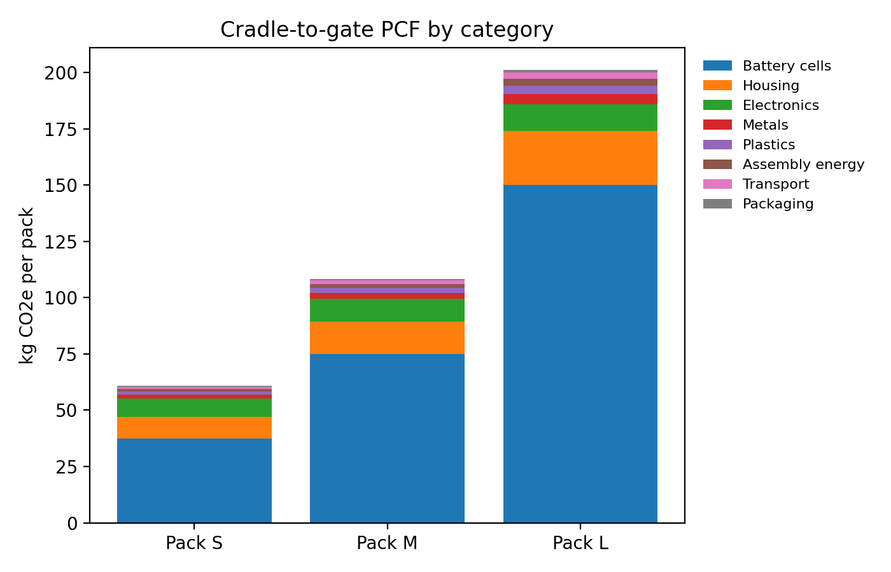
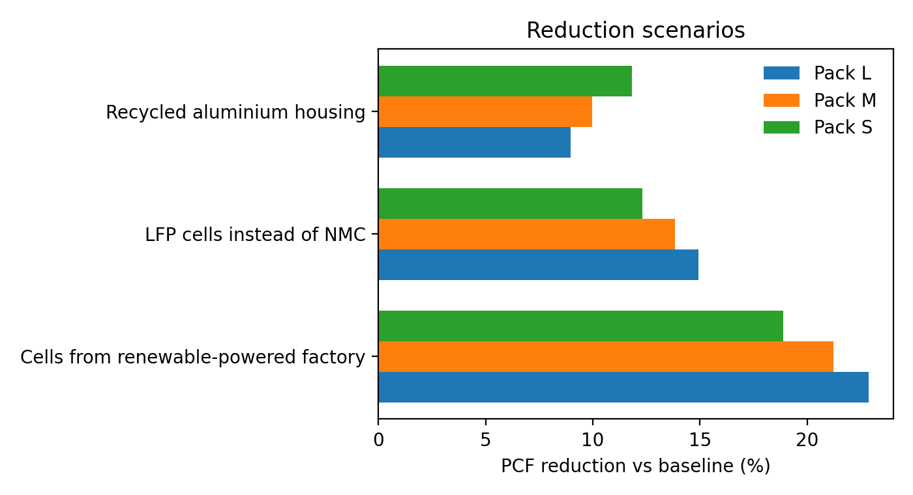

# Battery pack PCF report, 2025

Example Battery Assembly GmbH (fictional). Illustrative portfolio model, not real company data.

## Product carbon footprint (cradle to gate)

| Variant | Capacity (kWh) | kg CO2e per pack | kg CO2e per kWh | Battery cell share |
|---|---|---|---|---|
| S | 0.5 | 60.9 | 121.7 | 62% |
| M | 1.0 | 108.4 | 108.4 | 69% |
| L | 2.0 | 201.1 | 100.5 | 75% |

## Annual GHG inventory (t CO2e)

| Scope | t CO2e | Share |
|---|---|---|
| Scope 1 | 8.0 | 0% |
| Scope 2 | 68.4 | 2% |
| Scope 3 Cat 1 | 4311.0 | 97% |
| Scope 3 Cat 4 | 64.2 | 1% |
| **Total** | **4451.6** | 100% |

Capacity produced: 41.0 MWh. Intensity: 108.6 kg CO2e per kWh.

## Reduction scenarios

| Scenario | Variant | Reduction |
|---|---|---|
| LFP cells instead of NMC | S | 12.3% |
| LFP cells instead of NMC | M | 13.8% |
| LFP cells instead of NMC | L | 14.9% |
| Cells from renewable-powered factory | S | 18.9% |
| Cells from renewable-powered factory | M | 21.2% |
| Cells from renewable-powered factory | L | 22.9% |
| Recycled aluminium housing | S | 11.8% |
| Recycled aluminium housing | M | 10.0% |
| Recycled aluminium housing | L | 9.0% |

## Data quality

No blocking issues.
* Warning: 82% of inventory rows use secondary data. Prioritise primary data for hotspots.

